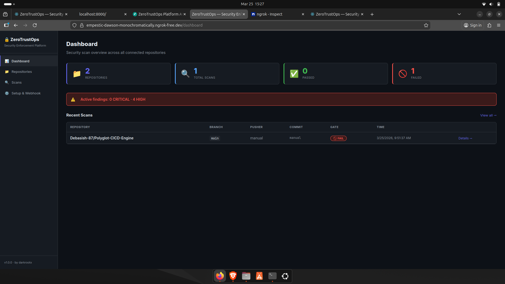
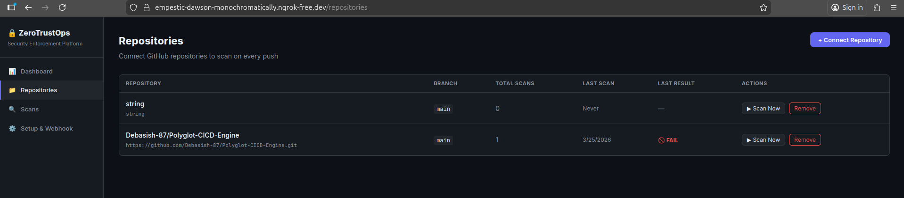
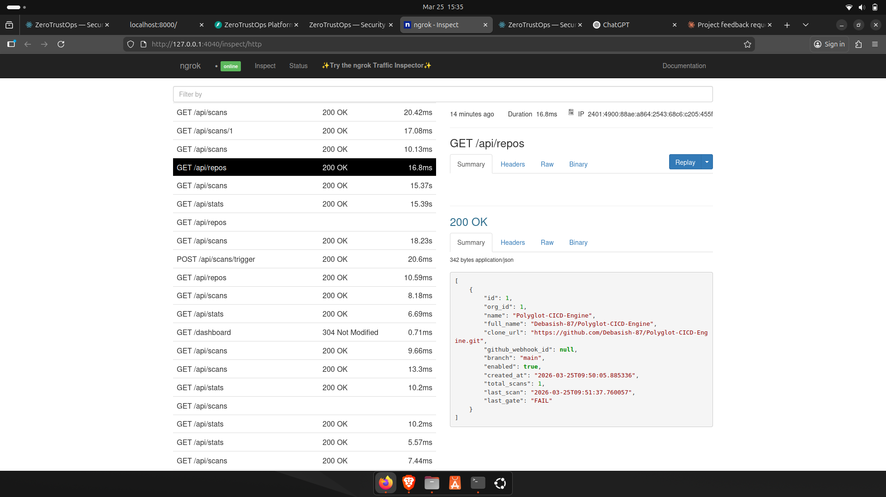
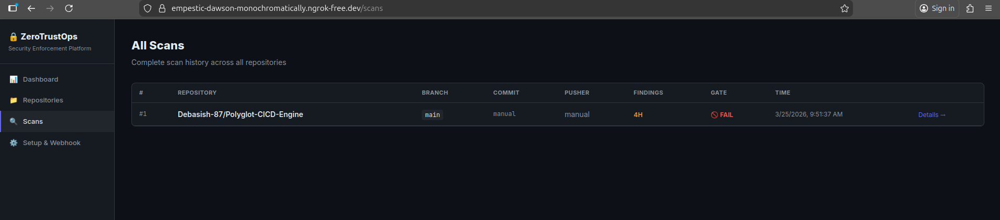
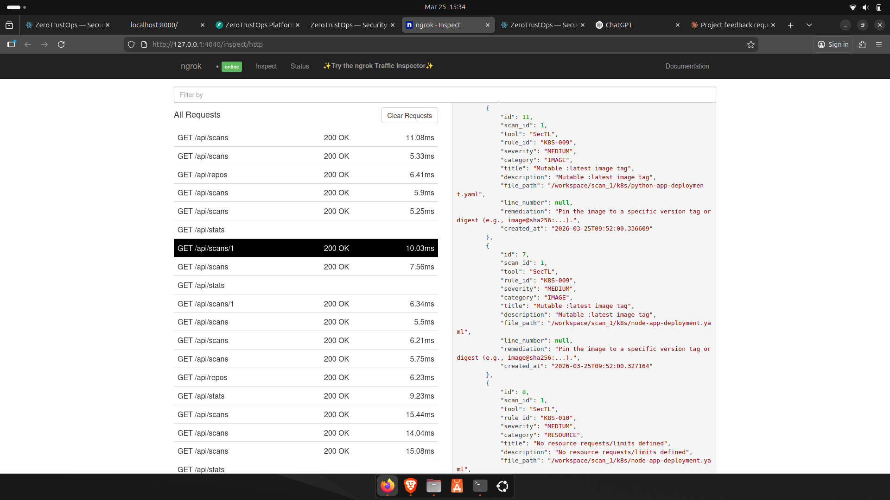
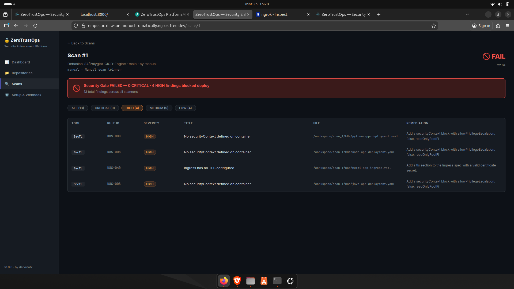
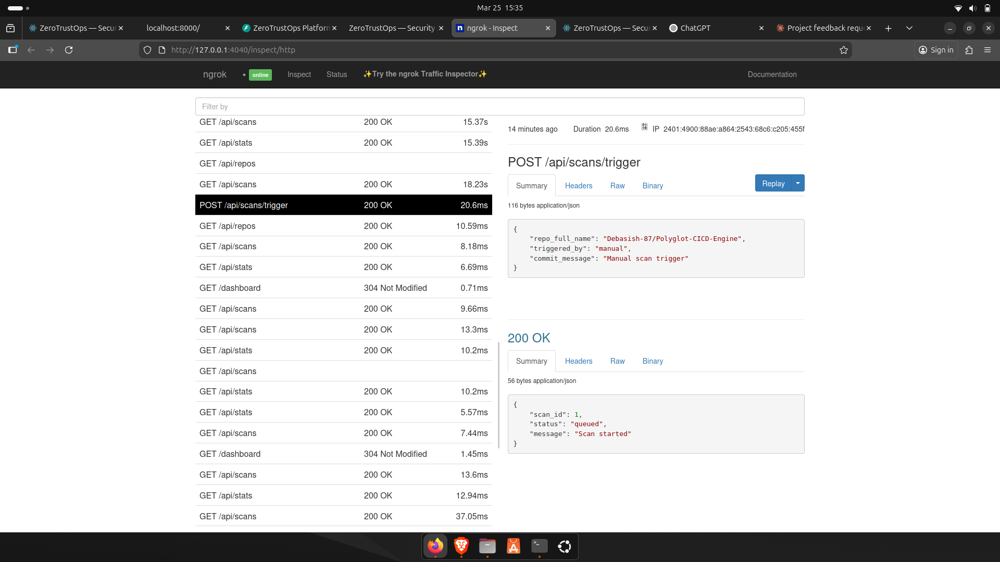

# ZeroTrustOps Platform

A self-hosted DevSecOps platform that scans every Git push and blocks security misconfigurations, hardcoded secrets, and infrastructure vulnerabilities before they reach production.


---

## Table of Contents

- [Screenshots](#screenshots)
- [Overview](#overview)
- [How It Works](#how-it-works)
- [Architecture](#architecture)
- [SecTL — Security Enforcement Engine](#sectl--security-enforcement-engine)
- [Quick Start](#quick-start)
- [GitHub Webhook Integration](#github-webhook-integration)
- [REST API Reference](#rest-api-reference)
- [Kyverno Admission Control Policies](#kyverno-admission-control-policies)
- [Database Schema](#database-schema)
- [Configuration](#configuration)
- [Running Tests](#running-tests)
- [Project Structure](#project-structure)
- [Roadmap](#roadmap)
- [Contributing](#contributing)
- [License](#license)

---

## Screenshots

**Dashboard**



Real-time overview of connected repositories, scan history, and security posture.

**Repository Management**



Add, remove, and monitor repositories. Each is automatically webhook-connected to the scan pipeline.



Per-repository scan summary with status indicators and quick-action controls.

**Scan Results**



Scan history list with PASS/FAIL status, timestamps, and scan type breakdown.



Detailed findings view showing rule ID, severity, file path, description, and remediation guidance per violation.



High-level scan result summary grouped by severity (CRITICAL to LOW) with finding counts.

**Triggering a Scan**



Manually trigger a scan from the dashboard, or let the GitHub webhook fire it automatically on every push.

---

## Overview

ZeroTrustOps treats every Git push as a security checkpoint. Powered by a custom static analysis engine (SecTL) and Gitleaks for secrets detection, it provides an end-to-end DevSecOps pipeline with automated scanning, CI/CD enforcement, and a real-time dashboard — all running locally from a single command.

**What the platform enforces:**

- Blocks insecure Kubernetes deployments before they reach the cluster
- Detects hardcoded credentials and secrets on every push
- Fails CI instantly on critical findings with a binary PASS/FAIL gate
- Enforces security policies at admission time using Kyverno
- Scans IaC across Kubernetes, Terraform, Helm, and container images
- Surfaces actionable remediation guidance per finding, not just raw logs

---

## How It Works

Every push flows through the following pipeline:

```
git push
  └── GitHub webhook triggers the scan pipeline
        └── Repository is cloned into an isolated scan environment
              |
              |-- Static Analysis (SecTL)
              |     |-- Scans IaC: Kubernetes, Terraform, Helm
              |     |-- Detects misconfigurations (RBAC, networking, privilege escalation)
              |     |-- Applies 70+ security rules
              |     └-- Assigns severity levels (CRITICAL -> LOW)
              |
              |-- Secrets Detection (Gitleaks)
              |     └-- Identifies API keys, tokens, passwords, exposed credentials
              |
              |-- Findings Processing
              |     |-- Normalizes results (rule_id, severity, file path)
              |     |-- Deduplicates issues
              |     └-- Attaches remediation guidance per finding
              |
              |-- Enforcement Engine (CI/CD Gate)
              |     |-- Evaluates findings against severity thresholds
              |     └-- Returns binary decision: PASS / FAIL
              |
              |-- Persistence Layer
              |     └-- Stores scan results, history, and findings in PostgreSQL
              |
              └-- Real-time Feedback Loop
                    |-- Updates dashboard instantly
                    |-- Displays per-repo PASS / FAIL status
                    |-- Shows severity breakdown
                    └-- Provides actionable fixes per finding
```

If a push fails the security gate, it does not deploy.

---

## Architecture

| Component        | Technology       | Role                                               |
|------------------|------------------|----------------------------------------------------|
| SecTL CLI        | Go 1.21+         | Custom static analysis engine with 70+ built-in rules |
| Platform API     | Python / FastAPI | Webhook receiver, scan orchestrator, REST API      |
| Dashboard        | React + Vite     | Real-time scan results and repository management   |
| Database         | PostgreSQL 16    | Persistent storage for repos, scans, and findings  |
| Secrets Scanner  | Gitleaks         | Detects hardcoded secrets and credentials          |

All services run in Docker Compose and communicate over an internal bridge network.

```
+------------------------------------------------------------+
|                    Docker Compose Network                  |
|                                                            |
|  +--------------+    +--------------+    +-------------+  |
|  |  React       |    |  FastAPI     |    | PostgreSQL  |  |
|  |  Dashboard   |<-->|  Backend     |<-->|    16       |  |
|  |  :3000       |    |  :8000       |    |  :5432      |  |
|  +--------------+    +------+-------+    +-------------+  |
|                             |                             |
|                    +--------v--------+                    |
|                    |   SecTL CLI     |                    |
|                    |   + Gitleaks    |                    |
|                    +-----------------+                    |
+------------------------------------------------------------+
                             ^
                             |  GitHub Webhook (ngrok tunnel)
                             |
                       +-----+------+
                       |  GitHub    |
                       |  Repos     |
                       +------------+
```

---

## SecTL — Security Enforcement Engine

SecTL is a purpose-built CLI written in Go. It scans Infrastructure-as-Code files for security misconfigurations and produces a binary PASS/FAIL exit code suitable for CI/CD gate use.

### Scan Types

| Type         | Target                 | Coverage                                                           |
|--------------|------------------------|--------------------------------------------------------------------|
| `k8s`        | Kubernetes manifests   | Pods, Deployments, RBAC, Ingress, ConfigMaps, ServiceAccounts      |
| `terraform`  | Infrastructure as Code | AWS, GCP, Azure — S3, IAM, Security Groups, RDS, EKS, CloudTrail  |
| `helm`       | Helm charts            | Chart.yaml, values.yaml, rendered templates                        |
| `posture`    | Live AWS account       | IAM root keys, MFA enforcement, password policy, S3 posture        |
| `supply-chain` | Container images     | Digest pinning, `:latest` tag detection, EOL base images           |

### Security Rules

**Kubernetes — Critical and High**

| Rule ID  | Severity | Description                                            |
|----------|----------|--------------------------------------------------------|
| K8S-001  | CRITICAL | `hostPID` enabled — container sees all host processes  |
| K8S-004  | CRITICAL | Privileged container — full host device access         |
| K8S-020  | CRITICAL | RBAC wildcard `apiGroups` (`*`)                        |
| K8S-024  | CRITICAL | Binding to `cluster-admin` role                        |
| K8S-025  | CRITICAL | Binding to unauthenticated or anonymous subject        |
| K8S-031  | HIGH     | Hardcoded secret in environment variable               |
| K8S-005  | HIGH     | `allowPrivilegeEscalation` not set to `false`          |

**Terraform — Critical and High**

| Rule ID    | Severity | Description                                        |
|------------|----------|----------------------------------------------------|
| TF-S3-010  | CRITICAL | S3 bucket ACL set to public                        |
| TF-IAM-001 | CRITICAL | IAM policy allows `Action: *` (all actions)        |
| TF-SG-001  | CRITICAL | Security group: sensitive port open to internet    |
| TF-RDS-002 | CRITICAL | RDS instance publicly accessible                   |
| TF-EKS-002 | HIGH     | EKS API server publicly accessible                 |

Full rule list: run `sectl rules`. Filter with `--source k8s`, `--source terraform`, or `--severity critical`.

### CLI Usage

```bash
# Scan Kubernetes manifests
sectl scan ./manifests --type k8s

# Scan Terraform and fail CI on HIGH severity or above
sectl scan ./infra --type terraform --severity high --fail-on-findings

# Scan a Helm chart
sectl scan ./charts/myapp --type helm

# Verify container images for digest pinning, EOL, and latest tag
sectl verify nginx:latest myapp:1.0.0

# Audit live AWS account posture
sectl audit --provider aws --region us-east-1

# JSON output for programmatic use
sectl scan ./manifests --type k8s --output json

# SARIF output for GitHub Security tab
sectl scan ./manifests --type k8s --output sarif
```

---

## Quick Start

### Prerequisites

| Dependency     | Minimum Version | Notes                       |
|----------------|-----------------|-----------------------------|
| Docker         | 24+             | With Docker Compose plugin  |
| Docker Compose | 2.x             | Bundled with Docker Desktop |
| Go             | 1.21+           | Required to compile SecTL   |
| Git            | Any             |                             |

### Installation

```bash
# Clone the repository
git clone https://github.com/Debasish-87/ZeroTrustOps-Platform.git
cd ZeroTrustOps-Platform

# Run the one-command installer
bash setup.sh
```

The `setup.sh` script will:

1. Verify all prerequisites are installed
2. Compile the SecTL binary from source
3. Build and start all Docker containers
4. Wait for all services to pass health checks

### Service Access

| Service       | URL                          | Description              |
|---------------|------------------------------|--------------------------|
| Dashboard     | http://localhost:3000        | React UI — main interface |
| API           | http://localhost:8000        | FastAPI backend          |
| API Reference | http://localhost:8000/docs   | Swagger / OpenAPI docs   |

### Uninstall

```bash
bash uninstall.sh
```

Removes all containers, volumes, images, networks, and the `sectl` binary. Source code is not affected.

---

## GitHub Webhook Integration

```bash
# Expose the platform publicly via ngrok
ngrok http 8000
```

In your GitHub repository, navigate to **Settings > Webhooks > Add webhook** and configure:

| Field        | Value                                         |
|--------------|-----------------------------------------------|
| Payload URL  | `https://<your-ngrok-url>/webhook/github`     |
| Content type | `application/json`                            |
| Events       | Push events                                   |

Every subsequent `git push` will automatically trigger a full scan.

---

## REST API Reference

| Method | Endpoint              | Description                         | Auth |
|--------|-----------------------|-------------------------------------|------|
| GET    | `/health`             | Health check — all services         | —    |
| GET    | `/api/stats`          | Dashboard overview counts           | —    |
| GET    | `/api/repos`          | List all connected repositories     | —    |
| POST   | `/api/repos`          | Add a new repository                | —    |
| DELETE | `/api/repos/:id`      | Remove a repository                 | —    |
| GET    | `/api/scans`          | List recent scans                   | —    |
| GET    | `/api/scans/:id`      | Scan detail with all findings       | —    |
| POST   | `/api/scans/trigger`  | Manually trigger a scan             | —    |
| POST   | `/webhook/github`     | GitHub push webhook receiver        | HMAC |

### Examples

**Trigger a scan:**

```bash
curl -X POST http://localhost:8000/api/scans/trigger \
  -H "Content-Type: application/json" \
  -d '{"repo_id": 1}'
```

**Get critical findings from a scan:**

```bash
curl http://localhost:8000/api/scans/42 | jq '.findings[] | select(.severity == "CRITICAL")'
```

---

## Kyverno Admission Control Policies

Three cluster-wide admission control policies are included. All run in `Enforce` mode and actively block non-compliant resources from entering the cluster.

| Policy                    | Mode    | Enforcement                                                        |
|---------------------------|---------|--------------------------------------------------------------------|
| `disallow-latest-tag`     | Enforce | Blocks containers using `:latest` or untagged images               |
| `disallow-privileged`     | Enforce | Blocks privileged containers, privilege escalation, host namespaces |
| `require-resource-limits` | Enforce | Requires CPU and memory requests and limits on all containers      |

```bash
# Apply all Kyverno policies to your cluster
kubectl apply -f manifests/kyverno-policies/

# Verify policies are active
kubectl get clusterpolicy
```

---

## Database Schema

```
organizations
    └── repositories
            └── scans
                    └── findings
```

Each `finding` record stores:

| Field         | Type | Description                               |
|---------------|------|-------------------------------------------|
| `tool`        | text | `sectl` or `gitleaks`                     |
| `rule_id`     | text | e.g. `K8S-001`, `TF-IAM-001`              |
| `severity`    | text | `CRITICAL`, `HIGH`, `MEDIUM`, `LOW`       |
| `category`    | text | e.g. `rbac`, `network`, `secrets`         |
| `title`       | text | Short rule description                    |
| `description` | text | Full violation explanation                |
| `file_path`   | text | Relative path to the affected file        |
| `remediation` | text | Steps to fix the violation                |

---

## Configuration

Create a `.env` file in the project root by copying `.env.example`:

```env
# Database
POSTGRES_USER=zerotrust
POSTGRES_PASSWORD=changeme
POSTGRES_DB=zerotrust

# GitHub Webhook
GITHUB_WEBHOOK_SECRET=your-secret-here

# API
API_HOST=0.0.0.0
API_PORT=8000
```

### Docker Compose Ports

| Service    | Internal Port | External Port |
|------------|---------------|---------------|
| Dashboard  | 3000          | 3000          |
| API        | 8000          | 8000          |
| PostgreSQL | 5432          | 5433          |

> Note: PostgreSQL is exposed on host port `5433` to avoid conflicts with a locally running Postgres instance.

---

## Running Tests

```bash
# Unit tests for SecTL scanners
cd sectl
go test ./internal/scanner/... -v

# Run with race condition detection
go test -race ./internal/...

# Test against sample manifests
sectl scan ./sectl/testdata/k8s --type k8s
sectl scan ./sectl/testdata/terraform --type terraform
```

**Included test data:**

| File                                  | Purpose                          |
|---------------------------------------|----------------------------------|
| `testdata/k8s/bad-deployment.yaml`    | Triggers K8S rules               |
| `testdata/k8s/good-deployment.yaml`   | Expected to produce zero findings |
| `testdata/terraform/bad-infra.tf`     | Triggers Terraform rules         |
| `testdata/terraform/good-infra.tf`    | Expected to produce zero findings |

---

## Project Structure

```
ZeroTrustOps-Platform/
├── setup.sh                        # One-command installer
├── uninstall.sh                    # Complete cleanup script
├── docker-compose.yml              # Service orchestration
│
├── sectl/                          # Security CLI (Go)
│   ├── main.go
│   ├── cmd/                        # scan, audit, verify, rules commands
│   │   ├── audit.go
│   │   ├── helpers.go
│   │   ├── root.go
│   │   ├── rules.go
│   │   ├── scan.go
│   │   └── verify.go
│   └── internal/
│       ├── scanner/                # K8s, Terraform, Helm analyzers and unit tests
│       │   ├── finding.go
│       │   ├── helm.go
│       │   ├── k8s.go
│       │   ├── k8s_test.go
│       │   ├── terraform.go
│       │   └── terraform_test.go
│       ├── posture/                # Live AWS account audit
│       │   └── aws.go
│       ├── supply/                 # Container image supply chain checks
│       │   └── chain.go
│       └── report/                 # Table, JSON, SARIF output renderers
│           └── render.go
│
├── platform/
│   ├── api/                        # FastAPI backend
│   │   ├── main.py                 # Webhook handler, scan engine, REST API
│   │   ├── requirements.txt
│   │   └── Dockerfile
│   ├── web/                        # React dashboard
│   │   ├── src/
│   │   │   ├── pages/
│   │   │   │   ├── Dashboard.jsx
│   │   │   │   ├── Repositories.jsx
│   │   │   │   ├── ScanDetail.jsx
│   │   │   │   ├── Scans.jsx
│   │   │   │   └── Setup.jsx
│   │   │   ├── components/
│   │   │   │   └── Layout.jsx
│   │   │   ├── App.jsx
│   │   │   └── main.jsx
│   │   └── Dockerfile
│   └── db/
│       └── init.sql                # PostgreSQL schema
│
└── manifests/
    ├── dev/                        # Hardened Kubernetes deployment example
    │   ├── deployment.yaml
    │   └── service.yaml
    └── kyverno-policies/           # Admission control enforcement policies
        ├── disallow-latest-tag.yaml
        ├── disallow-privileged.yaml
        └── require-resource-limits.yaml
```

---

## Roadmap

- [ ] GitHub commit status API — report PASS/FAIL directly on pull requests
- [ ] Slack and Microsoft Teams webhook notifications
- [ ] Trivy container image vulnerability scanning
- [ ] Falco runtime threat detection
- [ ] SARIF upload to GitHub Advanced Security via API
- [ ] Multi-organization support
- [ ] Prometheus metrics endpoint (`/metrics`)
- [ ] Role-based access control for multi-team environments
- [ ] GitLab webhook support

---

## Contributing

Contributions are welcome. To get started:

```bash
# Fork and clone
git clone https://github.com/<your-handle>/ZeroTrustOps-Platform.git
cd ZeroTrustOps-Platform

# Create a feature branch
git checkout -b feature/my-new-rule

# Add your rule in sectl/internal/scanner/
# Add a test in the corresponding _test.go file
# Add test fixtures in sectl/testdata/

# Run tests
go test ./...

# Submit a pull request
```

**Adding a new SecTL rule:** Refer to `sectl/internal/scanner/k8s.go` or `terraform.go` for existing patterns. Each rule requires a `RuleID`, `Severity`, `Title`, `Description`, and `Remediation` field.

---

## License

Distributed under the [Apache 2.0 License](LICENSE).

---

**Maintainer:** Debasish Mohanty — [github.com/Debasish-87](https://github.com/Debasish-87)
